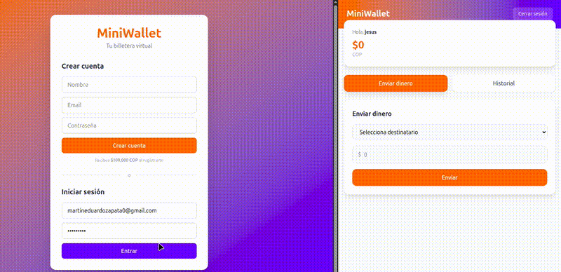

# MiniWallet

Aplicación web full-stack de billetera virtual con transferencias entre usuarios, autenticación JWT y despliegue con Docker Compose.

## Demo



## Tecnologías

- **Frontend**: React 18 + Tailwind CSS + Vite
- **Backend**: Node.js + Express
- **Base de datos**: PostgreSQL 16
- **Contenedores**: Docker Compose
- **Proxy**: Nginx (frontend sirve en :8080, API en :3001)

## Funcionalidades

- Registro e inicio de sesión con JWT
- Saldo en pesos colombianos (COP)
- Transferencias entre usuarios con transacciones SQL
- Historial de movimientos
- Comprobante/factura al enviar dinero
- Formato de números con separadores de miles

## Cómo ejecutar

```bash
docker compose up
```

Abrir [http://localhost:8080](http://localhost:8080)

## Estructura

```
miniwallet/
├── docker-compose.yml
├── api/
│   ├── Dockerfile
│   └── src/
│       ├── index.js          # Servidor Express
│       ├── db.js             # Conexión PostgreSQL
│       ├── seed.js           # Creación de tablas
│       └── routes/
│           ├── auth.js       # Registro y login
│           └── wallet.js     # Balance, transferencias, historial
└── frontend/
    ├── Dockerfile
    ├── nginx.conf            # Proxy reverso a la API
    └── src/
        └── pages/
            ├── Login.jsx     # Pantalla de login/registro
            └── Dashboard.jsx # Saldo, transferencias, historial
```

## API Endpoints

| Método | Ruta | Descripción |
|--------|------|-------------|
| POST | /api/register | Registrar usuario |
| POST | /api/login | Iniciar sesión |
| GET | /api/balance | Consultar saldo |
| POST | /api/transfer | Transferir dinero |
| GET | /api/transactions | Historial de movimientos |
| GET | /api/users | Listar usuarios |
